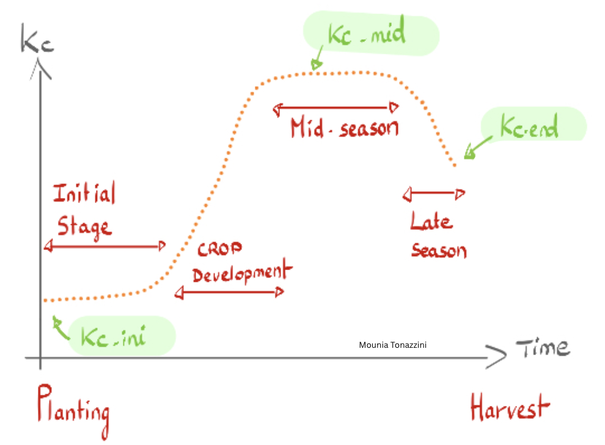

# AgriWater - Irrigation Needs Calculator


## Description
**AgriWater** is a specialized Python-based decision support tool designed to estimate crop irrigation requirements. By implementing the **[FAO-56 Penman-Monteith methodology](https://www.fao.org/4/X0490E/x0490e06.htm#chapter%202%20%20%20fao%20penman%20monteith%20equation)**, it bridges the gap between raw meteorological data and actionable agronomic insights.

The project combines:
* **Real-time weather data** integration via the Open-Meteo API.
* **Biophysical modeling** for evapotranspiration (ET0, ETc).
* **Rainfall deficit analysis** (effective precipitation).
* **Actionable recommendations** for field-level water management.

**Goal:** To help farmers and AgTech professionals optimize water use based on real-time biological needs rather than static schedules.


## Agronomic concepts used in this project
- **Kc (crop coefficient)** represents the difference in the amount of water lost through evapotranspiration between a specific non-stressed crop and a hypothetical, well-watered grass reference. It changes according to the growth stage of the plant and is plant specific.  



It integrates the characteristics of the crops (height, leaf area, canopy roughness, amount of soil exposed) that affect its water use. Here are the values we are going to use for the crops (Wheat, Maize, Tomato, Grapevine), studied in this project (FAO-56 reference) :

| Crop| Initial stage | Development stage | Mid-season | End of season |
|--------|---------------|---------------|---------------|---------------|
| Wheat    | 0.30          | 0.75          | 1.15          | 0.40          |
| Corn   | 0.30          | 0.80          | 1.20          | 0.60          |
| Tomato | 0.60          | 1.00          | 1.15          | 0.80          |
| Vine  | 0.30          | 0.70          | 0.85          | 0.45          |

- **Crop Evapotranspiration ($ET_c$)**: This represents the actual water demand of a given crop under specific conditions to grow optimally. 


- **Reference Evapotranspiration ($ET_0$)**: This represents the amount of water lost from a hypothetical, standardized surface (a large field of short green, actively growing and well-watered grass). There are several methods to calculate it, but the FAO standardized Penman-Monteith equation is the most accurate and widely accepted and is the one we are using in this project. Here is its equation : 

$$ET_0 = \frac{0.408 \Delta (R_n - G) + \gamma \frac{900}{T + 273} u_2 (e_s - e_a)}{\Delta + \gamma (1 + 0.34 u_2)}$$

*Where:*
* $R_n$ is the net radiation at the crop surface.
* $G$ is the soil heat flux density.
* $T$ is the mean daily air temperature at 2m height.
* $u_2$ is the wind speed at 2m height.
* $(e_s - e_a)$ represents the vapor pressure deficit.

(Note : a simplified alternative exists if needed : the Hargreaves equation that is less accurate but only needs temperatures).

- Reminder : (useful conversions used) 
    - 1 mm = 1 L/m²
    - 1 mm on 1 hectare = 10 m³
    - 1 hectare = 10,000 m²

## Key Features
* **Reference Evapotranspiration ($ET_0$)**: Precise calculation using the FAO Penman-Monteith equation.
* **Crop Evapotranspiration ($ET_c$)**: 
* **Phenological Tracking**: Integration of Crop Coefficients ($K_c$) tailored to specific growth stages.
* **Rainfall Integration**: Automated analysis of precipitation over 3, 5, or 7-day windows.
* **Irrigation Recommendations**: Dynamic output provided in $m^3/ha$.
* **Data Export**: Results available in CSV format.
* **Data visualizations**: 4 types of visualizations : 
        - Weather overview (ET0, temperature, precipitation)
        - ETc vs ET0 comparison
        - Water balance analysis
        - Irrigation recommendations summary

* **Supported crops**:
        - Wheat (Triticum aestivum)
        - Corn (Zea mays)
        - Tomato (Solanum lycopersicum)
        - Grapevine (Vitis vinifera)


## Scientific Methodology

The engine follows the **FAO Irrigation and Drainage Paper No. 56** standards.

For more information, see : docs/methodology.md


## Missing data

Missing meteorological data is handled at the data ingestion layer (meteo_api.py) via configurable strategies.
By default, the model raises an error if missing meteorological data is detected.
For pedagogical and exploratory purposes, alternative strategies can be explicitly enabled:
- "raise" → raises an error
- "zero" → fills NA with 0
- "interpolate" → interpolates the missing data
- "drop" → deletes the missing data


**Net Irrigation Requirement** : 
The final recommendation considers the effective rainfall ($P_{eff}$) to avoid over-irrigation:

$$Requirement = ET_c - P_{eff}$$


## Installation

### Prerequisites
* Python 3.8 or higher
* `pip` (Python package manager)
* Internet connection (for weather data)

### Setup
```
# Clone the repository
git clone https://github.com/Mounia-Agronomist-Datascientist/Agriwater.git
cd agriwater

# Create and activate a virtual environment
python -m venv venv
    # Windows:
    venv\Scripts\activate
    # Mac/Linux:
    source venv/bin/activate

# Install the project in editable mode with its dependencies
pip install -e .

# Now you can run it from anywhere
agriwater --help

```

### Quick Start
Run the interactive interface (CLI-based interactive workflow)
`agriwater`

Follow the guided workflow:

- Select a location (predefined or custom GPS coordinates)
- Choose a crop and growth stage
- Enter surface area in hectares
- Set analysis parameters (period, efficiency)
- View results and recommendations
- Export data or create visualizations


Quick example (Python script)
```python
from agriwater.irrigation_calculator import IrrigationCalculator

# Initialize calculator for corn in Montpellier
calc = IrrigationCalculator(
    latitude=43.6109,
    longitude=3.8772,
    crop_name="maize",
    crop_stage="mid_season",
    surface_ha=10.0
)

# Calculate and display irrigation needs
calc.display_full_report(period_days=7, efficiency=0.85)

# Create visualizations
calc.create_visualizations(output_dir="output")
```

### Project structure : 

```python
Agriwater/
│
├── pyproject.toml                    # Configuration and dependancies
├── README.md                         # This file
├── LICENSE                           # MIT License
├── .gitignore   
│                      
├── src/                             
│   └── agriwater/                   
│       ├── __init__.py
│       ├── crop_database.py          # Manage crop parameters
│       ├── main.py                   # Entry point
│       ├── meteo_api.py              # Weather data retrieval
│       ├── evapotranspiration.py     # ET0/ETc calculations
│       ├── irrigation_calculator.py  # Main orchestration
│       ├── visualizations.py         # Plot generation
│       ├── utils.py                  # Utilities (conversions)
│       ├── exceptions.py             # Custom exceptions
│       └── data/                     # Data inside the package
│       |   └── crops_parameters.json # JSON crop info (Kc, stages)
│       └── cli/                      # CLI folder
│           └──__init__.py
│           └──interface.py           # Interactive interface to calculate irrigation needs
│           └──agronomic_report.py.   # Synthetic report
│
├── notebooks/                        # Jupyter notebooks (optional)
│   └── demo_agriwater.ipynb          # Interactive demo
│
├── tests/                            # Tests of modules
│   ├── test_crop_database.py         
│   ├── test_workflow.py              # Integration test for the full AgriWater workflow              
│   ├── test_meteo_api.py             
│   ├── test_evapotranspiration.py     
│   ├── test_irrigation_calculator.py  
│   ├── test_visualizations.py         
│   ├── test_utils.py                  
│   ├── test_exceptions.py  
│   ├── test_interface.py 
│   ├── test_agronomic_report.py            
│
├── docs/                             # Documentation
│   ├── methodology.md                # FAO-56 methodology explained
│   └── user_guide.md          # User guide
│
└── output/                           # Generated outputs (created at runtime)
    ├── *.png                         # Visualization plots
    └── *.csv                         # Exported results

```

### Limitations and assumptions

- ET₀ computed under standard FAO assumptions
- No soil water holding capacity modeling
- No dynamic rooting depth
- Uniform field assumption
- Kc values taken from FAO-56 tables (generic)


### License
This project is licensed under the MIT License - see the LICENSE file for details.


### Author
Mounia Tonazzini
Agricultural Engineer & Data Scientist | AI & AgriTech

- Location: Montpellier, France
- Email: mounia.tonazzini@gmail.com
- LinkedIn: [www.linkedin.com/in/mounia-tonazzini](www.linkedin.com/in/mounia-tonazzini)
- GitHub: Mounia-Agronomist-Datascientist

### About Me
Combining 7 years of experience in agriculture (supply chain, farm support, sustainable food systems) with data science skills, I develop tools that bridge the gap between agronomic knowledge and digital innovation. AgriWater was developed during my Data Science training at Jedha to demonstrate how AI and modeling can support precision agriculture.
