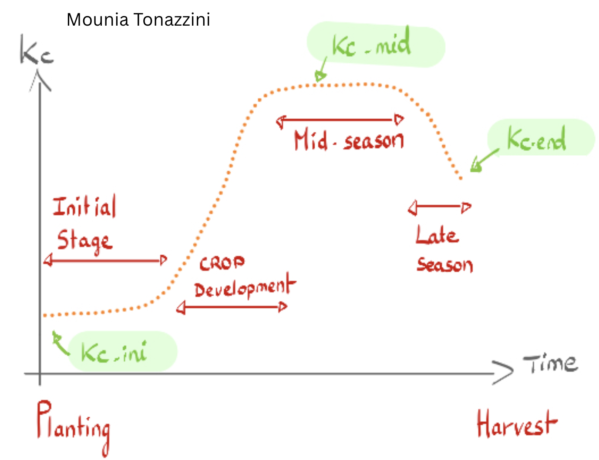
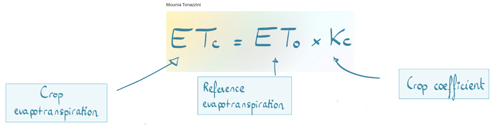

# AgriWater - Irrigation Needs Calculator


## Description
**AgriWater** is a specialized Python-based decision support tool designed to estimate crop irrigation requirements. By implementing the **[FAO-56 Penman-Monteith methodology](https://www.fao.org/4/X0490E/x0490e06.htm#chapter%202%20%20%20fao%20penman%20monteith%20equation)**, it bridges the gap between raw meteorological data and actionable agronomic insights.

The project combines:
* **Real-time weather data** integration via the Open-Meteo API.
* **Biophysical modeling** for evapotranspiration (ET0, ETc).
* **Rainfall deficit analysis** (effective precipitation).
* **Actionable recommendations** for field-level water management.

**Goal:** To help farmers and AgTech professionals optimize water use based on real-time biological needs rather than static schedules.


## Agronomic concepts used in this project
- **Kc (crop coefficient)** represents the difference in the amount of water lost throught evapotranspiration between a specific non stressed crop and a hypothetical, well-watered grass reference. It changes according to the growing stage of the plant and is plant specific.  



It integrates the characteristics of the crops (height, leaf area, canopy roughness, amount of soil exposed) that affect its water use. Here are the values we are going to use for the crops (Wheat, Maize, Tomato, Grapevine), studied in this project (FAO-56 reference) :

| Crop| Initial stage | Development stage | Mid-season | End of season |
|--------|---------------|---------------|---------------|---------------|
| Wheat    | 0.30          | 0.75          | 1.15          | 0.40          |
| Corn   | 0.30          | 0.80          | 1.20          | 0.60          |
| Tomato | 0.60          | 1.00          | 1.15          | 0.80          |
| Vine  | 0.30          | 0.70          | 0.85          | 0.45          |

- **Crop Evapotranspiration ($ET_c$)**: This represents the actual water demand of a given crop under specific conditions to grow optimally. 



- **Reference Evapotranspiration ($ET_0$)**: This reprensents the amount of water lost from a hypothetical, standardized surface (a large field of short gree, actively growing and well-watered grass). There are several methods to calculate it, but the FAO standardized Penman-Monteith equation is the most accurate and widely accepted and is the one we are using in this project. Here is its equation : 

$$ET_0 = \frac{0.408 \Delta (R_n - G) + \gamma \frac{900}{T + 273} u_2 (e_s - e_a)}{\Delta + \gamma (1 + 0.34 u_2)}$$

*Where:*
* $R_n$ is the net radiation at the crop surface.
* $G$ is the soil heat flux density.
* $T$ is the mean daily air temperature at 2m height.
* $u_2$ is the wind speed at 2m height.
* $(e_s - e_a)$ represents the vapor pressure deficit.

(Note : it exists a simplified alternative if needed : the Hargreaves equation that is less accurate but only needs temperatures).

- Reminder : (useful conversions used) 
    - 1 mm = 1 L/m²
    - 1 mm on 1 hectare = 10 m³
    - 1 hectare = 10,000 m²

## Key Features
* **Reference Evapotranspiration ($ET_0$)**: Precise calculation using the FAO Penman-Monteith equation.
* **Crop Evapotranspiration ($ET_c$)**: 
* **Phenological Tracking**: Integration of Crop Coefficients ($K_c$) tailored to specific growth stages.
* **Rainfall Integration**: Automated analysis of precipitation over 3, 5, or 7-day windows.
* **Irrigation Recommendations**: Dynamic output provided in $m^3/ha$.
* **Data Export**: Results available in CSV format.

## Scientific Methodology

The engine follows the **FAO Irrigation and Drainage Paper No. 56** standards.

**Net Irrigation Requirement** : 
The final recommendation considers the effective rainfall ($P_{eff}$) to avoid over-irrigation:

$$Requirement = ET_c - P_{eff}$$


## Installation

### Prerequisites
* Python 3.8 or higher
* `pip` (Python package manager)

### Setup
```bash
# Clone the repository
git clone https://github.com/Mounia-Agronomist-Datascientist/Agriwater.git
cd agriwater

# Create and activate a virtual environment
python -m venv venv
    # Windows:
    venv\Scripts\activate
    # Mac/Linux:
    source venv/bin/activate

# Install dependencies
pip install -r requirements.txt