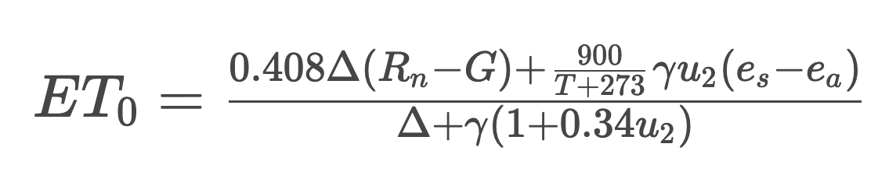

# FAO-56 Methodology for Irrigation Requirement Calculation

## Introduction
This document explains the methodology used by **AgriWater** to calculate crop irrigation requirements. It is based on the FAO (Food and Agriculture Organization of the United Nations) reference document:  
**Irrigation and Drainage Paper No. 56 – _Crop Evapotranspiration: Guidelines for Computing Crop Water Requirements_.**

## 1. Reference Evapotranspiration (ET₀)

### Definition
ET₀ (reference evapotranspiration) represents the amount of water evaporated and transpired by a reference surface (well-watered grass, uniform and actively growing) under given climatic conditions.

### FAO-56 Penman–Monteith Equation

Where:

- **Rn** = Net radiation at the crop surface (MJ m⁻² day⁻¹)  
- **G** = Soil heat flux density (MJ m⁻² day⁻¹)  
- **T** = Mean daily air temperature at 2 m height (°C)  
- **u₂** = Wind speed at 2 m height (m s⁻¹)  
- **es** = Saturation vapour pressure (kPa)  
- **ea** = Actual vapour pressure (kPa)  
- **Δ** = Slope of vapour pressure curve (kPa °C⁻¹)  
- **γ** = Psychrometric constant (kPa °C⁻¹)  

### Units
- **mm/day**: millimetres of water per day  
- 1 mm = 1 L/m² = 10 m³/ha  

### Data Source
In **AgriWater**, ET₀ values are retrieved directly from the **Open-Meteo API**, which computes ET₀ using the FAO Penman–Monteith method.

## 2. Crop Coefficient (Kc)

### Definition
The **Kc (crop coefficient)** links ET₀ to crop evapotranspiration (ETc). It varies according to:

- Crop type  
- Phenological stage (growth, flowering, maturation)  
- Local conditions (climate, agricultural practices)  

### Phenological Stages
Crops generally go through four main stages:

#### 1. Initial Stage
- From planting/sowing to ~10% ground cover  
- Low Kc (0.30 – 0.60)  
- Limited leaf area, soil evaporation dominant  

#### 2. Development Stage
- Active vegetative growth  
- Gradual increase in Kc  
- Canopy development  

#### 3. Mid-Season Stage
- Maximum ground cover  
- Maximum Kc (1.00 – 1.30)  
- Full vegetative maturity, flowering, fruiting  

#### 4. Late Season Stage
- Maturation and senescence  
- Decreasing Kc (0.40 – 0.80)  
- Leaves yellow, plant dries  

### Kc Values Used in AgriWater (FAO-56)

| Crop     | Initial | Development | Mid-season | Late season |
|---------|--------:|------------:|-----------:|------------:|
| Wheat   | 0.30 | 0.75 | 1.15 | 0.40 |
| Maize   | 0.30 | 0.80 | 1.20 | 0.60 |
| Tomato  | 0.60 | 1.00 | 1.15 | 0.80 |
| Grapevine | 0.30 | 0.70 | 0.85 | 0.45 |

---

## 3. Crop Evapotranspiration (ETc)

### Formula
_ETc = ET0 * Kc_

### Interpretation
ETc represents the **actual water requirement of the crop** for optimal growth, expressed in mm/day.

### Example Calculation

**Given:**
- ET₀ = 5 mm/day  
- Crop: maize at mid-season  
- Kc = 1.20  

**Calculation:**

ETc = 5 * 1.20 = 6 mm/day

**Interpretation:**  
Maize requires **6 mm of water per day** for optimal growth.

## 4. Accounting for Rainfall

### Effective Rainfall
Not all rainfall is available to the crop:

- Part evaporates  
- Part runs off  
- Part percolates beyond the root zone  

**Effective rainfall** is the fraction actually available to the plant.

### Accumulation Period
The rainfall accumulation period depends on:

#### Soil Type
- Sandy soil (low retention): ~3 days  
- Loamy soil: ~5 days  
- Clay soil (high retention): ~7 days  

#### Crop Sensitivity
- Sensitive (tomato, lettuce): 3–5 days  
- Intermediate (wheat, rapeseed): ~5 days  
- Resistant (grapevine, trees): ~7 days  

#### Climate
- High evaporation → shorter periods  
- Moderate evaporation → longer periods  

### In AgriWater
By default, AgriWater uses the **recommended period for each crop**, defined in `crops_parameters.json`.

## 5. Irrigation Requirement Calculation

### Net Irrigation Requirement
_Net requirement = ETc - Effective rainfall_

If the result is negative, **no irrigation is required**.

### Gross Irrigation Requirement
Accounts for irrigation system losses:

_Gross requirement = Net requirement/Irrigation efficiency_

Typical efficiencies:
- Surface irrigation: 60–75%  
- Sprinkler: 75–85%  
- Drip irrigation: 85–95%  

### Complete Example

**Given:**
- Area: 10 ha  
- Average ETc: 5 mm/day  
- Period: 7 days  
- Cumulative rainfall: 15 mm  
- Efficiency: 85%  

**Calculations:**

ETc over 7 days:
ETc = 5 × 7 = 35 mm

Net requirement:
35 − 15 = 20 mm

Gross requirement:
20 / 0.85 = 23.5 mm

Water volume:
23.5 mm × 10 m³/mm/ha × 10 ha = 2,350 m³

**Recommendation:**  
Apply approximately **2,350 m³ of water** over 10 hectares for the 7-day period.

## 6. Useful Conversions

### Water Units

| From | To | Formula |
|-----|----|---------|
| mm | L/m² | 1 mm = 1 L/m² |
| mm | m³/ha | 1 mm = 10 m³/ha |
| m³ | mm (over X ha) | mm = m³ / (10 × X) |

**Example**  
How many m³ for 15 mm over 5 ha?
15 × 10 × 5 = 750 m³

## 7. Limitations and Precautions

### - Model Simplifications
AgriWater uses simplifications for accessibility:

- Constant Kc per stage (real Kc evolves continuously)  
- Rainfall assumed 100% effective  
- No soil water storage modelling  
- No water stress modelling  

### - Usage Recommendations
Use AgriWater to:
- Quickly estimate irrigation needs  
- Compare scenarios  
- Plan irrigation schedules  

Do not use for:
- Critical decisions without field validation  
- Fully automated irrigation without supervision  

### - Improving Accuracy
To improve precision:
- Adjust Kc values locally  
- Account for soil type  
- Measure soil moisture (sensors)  
- Integrate weather forecasts  

## References

Allen, R.G., Pereira, L.S., Raes, D., Smith, M. (1998)  
*Crop evapotranspiration – Guidelines for computing crop water requirements*  
FAO Irrigation and Drainage Paper 56  
http://www.fao.org/3/x0490e/x0490e00.htm  

Doorenbos, J., Pruitt, W.O. (1977)  
*Crop water requirements*  
FAO Irrigation and Drainage Paper 24  

Open-Meteo API  
Meteorological data and ET₀ source  
https://open-meteo.com/

## Future Developments

Planned features for AgriWater:
- Soil water storage modelling  
- Weather forecast integration  
- Water stress modelling  
- Real irrigation efficiency calculation  
- Economic optimisation of irrigation  
- Integration of soil moisture sensors  

**Author:** Mounia Tonazzini  
**Date:** December 2025  
**License:** MIT
